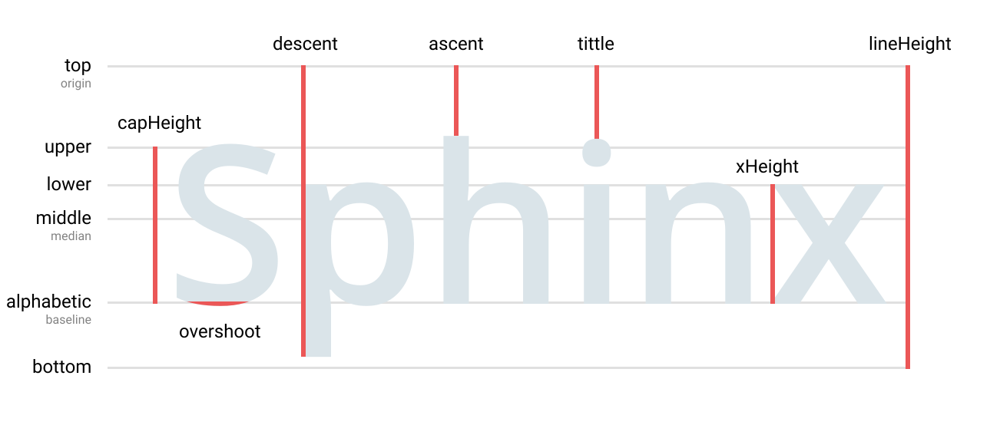

# font-measure [](http://github.com/badges/stability-badges)

Calculate metrics for a font metrics.

[](https://npmjs.org/package/font-measure/)

```js
let measure = requrie('font-measure')

measure('Roboto')

/*
{
  top: 0,
  bottom: 1.3125,
  lower: 0.515625,
  upper: 0.328125,
  xHeight: 0.53125,
  alphabetic: 1.046875,
  baseline: 1.046875,
  capHeight: 0.71875,
  median: 0.65625,
  middle: 0.65625,
  ascent: 0.28125,
  descent: 0.328125,
  hanging: 0.21875,
  ideographic: 1,
  lineHeight: 1.3125,
  tittle: 0.28125,
  overshoot: 0
}
 */

```

## API

### `metrics = measure(font|options)`

Get metrics data for a font or custom options.

#### `metrics`:




#### `options`:

Property | Default | Meaning
---|---|---
`family` | `null` | Font-family to detect metrics. Can be a string or an array (fontstack).
`origin` | `top` | Origin for metrics. Can be changed to `baseline` or any other metric.
`size` | `64` | Font-size to use for calculations. Larger size gives higher precision with slower performance.
`canvas` | `measure.canvas` | Canvas to use for measurements.
`tittle` | `i` | Character to detect tittle. Null value ignores calculation.
`descent` | `p` | Character to detect descent line. Null value ignores calculation.
`ascent` | `h` | Character to detect ascent line. Null value ignores calculation.
`overshoot` | `O` | Character to detect overshoot. Null value ignores calculation.
`upper` | `H` | Character to detect upper line / cap-height. Null value ignores calculation.
`lower` | `x` | Character to detect lower line / x-height. Null value ignores calculation.


## See also

* [optical-properties](https://ghub.io/optical-properties) − calculate image/character optical center and bounding box.
* [detect-kerning](https://ghub.io/detect-kerning) − calculate kerning pairs for a font.

## Related

There are many text / font measuring packages for the moment, but most of them don't satisfy basic quality requirements. Special thanks to @soulwire
 for [fontmetrics](https://ghub.io/fontmetrics) as model implementation.

## License

© 2018 Dima Yv. MIT License

Development supported by plot.ly.
